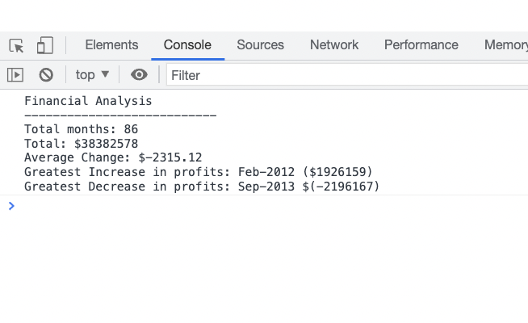

# Portfolio Finances

## A console to show finance calculations

This project displays finincial analysis in the console, available to view inside the 'dev tools' option in a browser. It contains the following:

- Total number of months presented in the data.
- The total profit over the given period.
- The average change in profit over the given period.
- The greatest increase in profits over the given period.
- The greatest decrease in losses over the given period.

## Installation

N/A

## Usage

Wesbite link: https://henryjamesgreen.github.io/Console-Finances/

To run the code, visit the link above, and access dev tools, by pressing command+Option+I (macOS) or Control+Shift+I (Windows), and then selecting 'console' to view the data.

## Credits

- toFixed Documentation - https://developer.mozilla.org/en-US/docs/Web/JavaScript/Reference/Global_Objects/Number/toFixed
- Marta Milewczyk (via Slack) - https://github.com/MartaMilewczyk
- Sean Howe (via slack) - https://github.com/SeanMH8911
- w3 Schools (indexOf) - https://www.w3schools.com/jsref/jsref_indexof.asp
- Math.min and Math.max - mdn web docs\_ - https://developer.mozilla.org/en-US/docs/Web/JavaScript/Reference/Global_Objects/Math/min

## License

Please refer to the licence in the repo.
